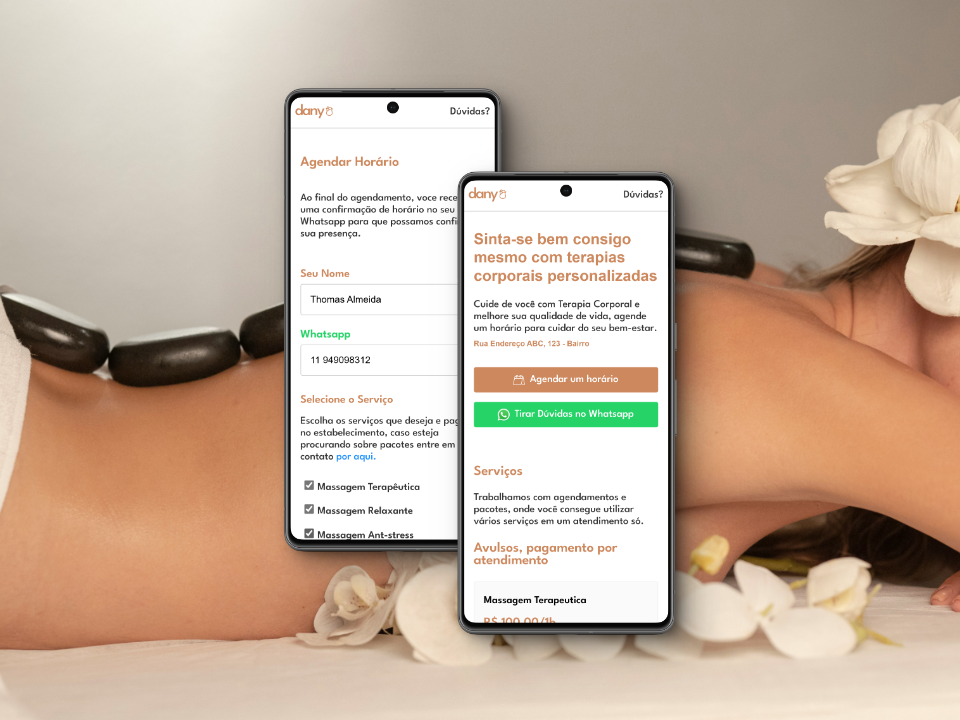

# Dany Terapia Corporal - Landing Page MVP

## Landing Page de agendamentos para a clínica de estética da minha mãe
### Tecnologias: ReactJS | Node com API do Telegram | Vercel e Render para hospedagens
Criei esse projeto com o intuito e necessidade de trazer novos contatos e possíveis clientes para o negócio, assim o espaço de estética não teria apenas a fonte organica e boca a boca como meio de trazer clientes, e sim de uma forma constante com uma landing page que possa receber o envio de agendamentos de uma forma centralizada e usando tecnologias do front-end e construindo um backend simples com uma integração que centralizasse e armazenasse os agendamentos. Dito isso, este projeto tem 3 pontos de destaque:

+ Aprimorar e se acostumar a usar um frontend reativo: Utilizar React e trabalhar com Vue.js no meu emprego principal me faz ter que estudar cada vez mais as tecnologias mais atuais do frontend, com isso este projeto é feito em react, como é um mvp simples, não apelei para typescript ou nem mesmo para frameworks css (dos quais eu sinceramente não curto usar)
+ Entender mais sobre consumo de API's: outra skill importante e necessário no frontend é consumir API's e lidar com os dados que elas fornecem, ao decorrer do desenvolvimento do projeto fui buscando API's que me ajudassem a nao precisar criar um backend, mas logo me vi tendo que aprender (e isso foi ótimo) a criar um backend com rotas para realizar as ações que eu precisava, então evolui nos meus conhecimentos em consumo de API's quando criei um backend que consome a API de bots do telegram para que o bot envie para mim uma mensagem com os dados dos agendamentos sempre que eles são feitos na landing page. [acesse o repositório do meu backend aqui](https://github.com/thomas-almeida/nino-scheduler)
+ Anunciar no Google de forma assertiva: bom, não é apenas criar a landing page que faz ela bombar no tráfego, então estudar formas de alimentar o tráfego e trazer assertividade aos agendamentos é essencial e a pricipal "feature" que a LP deve atender, no final de tudo, o MVP deve cumprir seu papel trazendo resultados concretos e monetizando o projeto. saber anunciar e gerir o tráfego da landing page é o real e principal desafio deste projeto.

Contudo, pretendo continuar atualzando e otimizando este pronjeto com a esperança que este MVP cresça e seja um canal de captação que impulsione o negócio da minha mãe novamente e escale o negócio, fazendo ele ser uma fonte de trabalho duro e muito sucesso!
você pode acompanhar a trilha de desenvolvimento e roadmap das tarefas [por aqui](https://purrfect-blarney-e5a.notion.site/73a04579b755479aba9cdd0f4b804e9f?v=1f8ca229f65e4c89a39bebf1556561f6&pvs=4)
